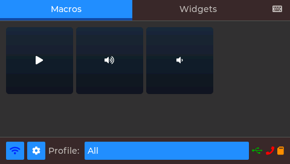
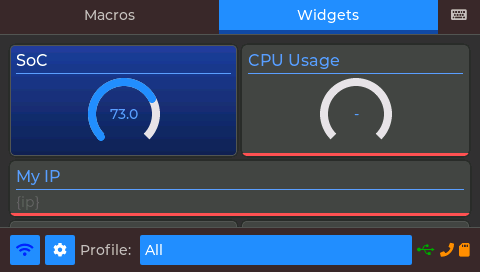
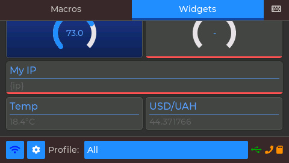
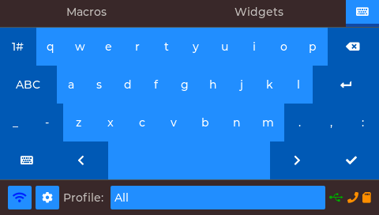
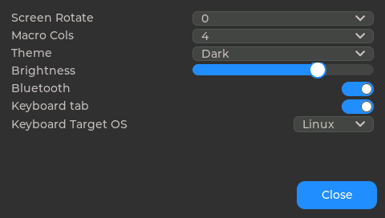
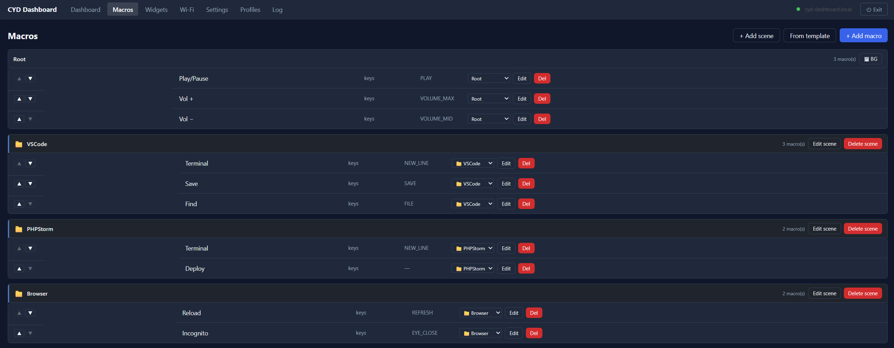
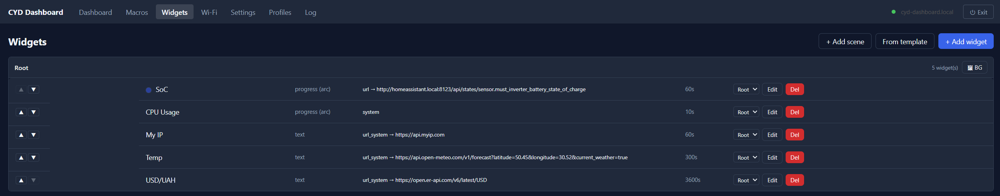
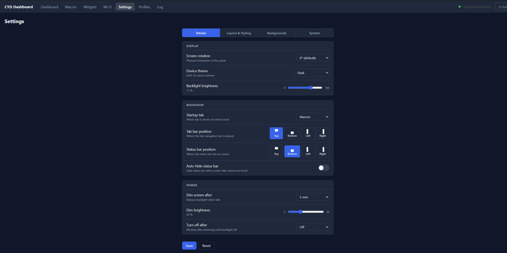

# CYD Dashboard

A touchscreen macro & widget dashboard for **Sunton "Cheap Yellow Display" (CYD)** ESP32 boards, configured entirely from a browser.

Define buttons that send keyboard shortcuts, fire URLs, switch scenes, or toggle states — and widgets that pull live data from HTTP endpoints or host system metrics. Everything is editable from a Vue web UI; the device acts as a BLE/USB keyboard or relays input through a desktop companion app.

| | | | | |
|---|---|---|---|---|
|  |  |  |  |  |
| Macros | Widgets | Widgets (scrolled) | Virtual keyboard | Settings |

## Features

- **Macros** — keys, URL calls, commands, scenes (folders), toggles, and multi-step actions, with per-button icons, colours and images.
- **Widgets** — live tiles fed by URL polling (via browser/companion proxy) or host system metrics, with flexible grid / masonry layouts.
- **Profiles & scenes** — group macros, switch sets on the fly, per-scene backgrounds.
- **HID output** — BLE keyboard (NimBLE), USB HID (S3/C3), or desktop **companion** relay; auto-selected by priority.
- **Virtual keyboard tab** — on-device LVGL keyboard sends live keypresses via the active HID backend; input-language switch button sends the OS-appropriate shortcut (Win+Space / Ctrl+Space / Super+Space), configurable per target OS.
- **Web UI** — Vue 3 SPA delivered from a multi-CDN chain with on-device fallback; no large bundle stored on the device.
- **Dashboard page** — device telemetry: free heap / PSRAM, uptime, Wi-Fi RSSI / IP, connection state.
- **OTA** — firmware update over the web on 16 MB-flash boards.
- **Backgrounds & icons** — upload images; auto-converted to device formats on the SD card.

## Supported boards

Configured PlatformIO environments:

| env | chip | PSRAM | notes |
|-----|------|-------|-------|
| `esp32-2432S028Rv2` | ESP32 | no | 320×240 ILI9341; tight DRAM — see [docs/ARCHITECTURE.md](docs/ARCHITECTURE.md) |
| `JC4827W543C` | ESP32-S3 | yes | 480×272; 4 MB flash (no OTA); microSD + USB-HID — see note |

Built on [esp32-smartdisplay](https://github.com/rzeldent/esp32-smartdisplay), which supports the full Sunton CYD range — additional boards can be added as new `[env:…]` blocks in `platformio.ini`.

**JC4827W543C** has an onboard microSD (TF) card on `CS=10, MOSI=11, SCLK=12, MISO=13` — these pins are in the upstream board definition (`boards/` submodule). The only local override (in `[env:JC4827W543C]`) is `ARDUINO_USB_MODE=0` (TinyUSB / OTG) so the USB-HID keyboard works on the S3; upstream defaults to hardware-CDC, which suits other users.

## Flash from browser (no toolchain)

Easiest path — flash a release build straight from Chrome/Edge over USB via
[ESP Web Tools](https://esphome.github.io/esp-web-tools/):

**→ [ange007.github.io/CYD-Dashboard/flash.html](https://ange007.github.io/CYD-Dashboard/flash.html)**

Connect the board, click Install — the chip (ESP32 / ESP32-S3) is detected and
the matching merged image (bootloader + app + filesystem) is written. Chromium
browsers only; Windows may need a [CH340](https://www.wch.cn/downloads/CH341SER_EXE.html)
or [CP2102](https://www.silabs.com/developer-tools/usb-to-uart-bridge-vcp-drivers) driver.

## Quick start (from source)

```bash
git clone --recurse-submodules <repo-url>
cd CYD_Dashboard
```

> The `boards/` submodule is required — don't forget `--recurse-submodules`.

Pick your board's env (`default_envs` in `platformio.ini`), then:

```bash
pio run -t upload      # flash firmware
pio run -t uploadfs    # build the web bundle + pack LittleFS (icons, fallback assets, shell)
```

On first boot configure Wi-Fi (on-screen or via the web UI), then open `http://cyd-dashboard.local/` (or the device IP) to configure macros and widgets.

## Web UI

The device serves a ~1 KB HTML **shell**; the shell loads the full SPA (`app.js`) from a CDN (jsdelivr → githack → on-device fallback), with Vue/Pinia/Router resolved from `esm.sh`. This keeps the ~200 KB bundle off the device's flash and heap. See [docs/ARCHITECTURE.md](docs/ARCHITECTURE.md) for the delivery design and the no-PSRAM memory constraints.

| | | |
|---|---|---|
|  |  |  |
| Macros editor | Widgets editor | Settings |

### Install as a desktop app

The dashboard can be pinned as a native-looking window (own icon, no address bar) directly from your browser — no toolchain or HTTPS required:

| Browser | Steps |
|---------|-------|
| **Microsoft Edge** | `⋯` menu → **Apps** → **Install this site as an app** |
| **Google Chrome** | `⋯` → *Cast, save and share* → **Create shortcut** → ✓ *Open as window* |

> **Note:** This creates an app window, but offline (service-worker) caching and the automatic install banner require HTTPS, which the LAN HTTP device cannot provide. For a fully headless, always-on proxy that runs without a browser see the **[Companion app](#companion-app)** below.

Local development:

```bash
cd web
npm install
npm run dev        # Vite dev server; proxies /api + /ws to the device
```

## Releases

Versioning is driven by `custom_spa_version` in `platformio.ini`. Bump it and push — GitHub Actions ([.github/workflows/release.yml](.github/workflows/release.yml)) builds the web bundle, commits `web/dist/`, tags the version, and purges the CDN so the shell can fetch the matching `app.js`.

**Always use a fresh version number** — jsdelivr caches tags immutably; reused/moved tags serve stale bundles.

## Companion app

The desktop **companion** ([companion/](companion) submodule, Go + Wails, also at [ange007/CYD-Dashboard-Companion](https://github.com/ange007/CYD-Dashboard-Companion)) connects to the device over WebSocket and provides:

- **HID relay** — injects keypresses and text typed on the CYD into the host PC (Windows `SendInput`; macOS/Linux stub).
- **Fetch proxy** — performs `get_url` HTTP requests on the device's behalf (no CORS, no 64 KB limit).
- **System metrics** — supplies CPU, memory, disk, network, and temperature data to CYD widgets.
- **Device telemetry** — heap, uptime, Wi-Fi RSSI/IP, connection state shown in its own dashboard.
- **Profile switching** — shows the active macro profile and switches it from the desktop, manually or via **focus rules** that auto-switch based on the active application (full focus detection on Windows; app-name only on macOS; X11/Hyprland on Linux).
- **Auto-discovery** — finds the device via mDNS or a fixed URL.
- **Background tray daemon** — persists as a system-tray icon; optional start-at-login (Registry / LaunchAgent / XDG autostart).

The companion is the recommended HID backend on machines where BLE is unreliable or unavailable.
